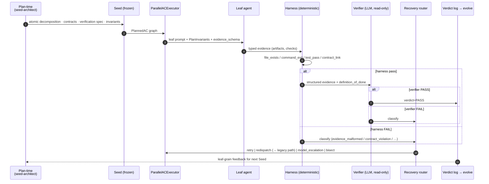

# RFC: Seed-as-Verifiable-Execution-Graph — a boundary proposal for #956 / #920 / #946

| | |
|---|---|
| Status | Draft (community contribution) |
| Author | shaun0927 |
| Created | 2026-05-13 |
| Targets | [#956 Workflow IR](https://github.com/Q00/ouroboros/issues/956) · [#920 fat-harness](https://github.com/Q00/ouroboros/issues/920) · [#946 Run/Step/Artifact projections](https://github.com/Q00/ouroboros/issues/946) |
| Process anchor | [#961 SSOT](https://github.com/Q00/ouroboros/issues/961) — "Projection vs IR node boundary" decision (still owed) |

## TL;DR

The AgentOS roadmap already covers (a) typed evidence and verifier loops (#920 / #830), (b) Run/Step/Artifact projections (#946), and (c) a typed Workflow IR (#956). What is still owed, per #961, is the **boundary decision** between the IR-node layer and the projection layer. This RFC proposes a specific resolution:

> **Promote `Seed.acceptance_criteria` from `tuple[str, …]` to a typed graph (`tuple[str | PlannedAC, …]`) so that atomicity, dependency, contract, and verification metadata live in the Seed itself. Workflow IR (#956) then projects an already-typed plan, instead of inferring it at dispatch time. Run/Step/Artifact projections (#946) and the fat-harness loop (#920) consume this Seed shape on a fast path; legacy `str` ACs continue through the existing path.**

Concretely: most runtime LLM inference for atomicity / decomposition / dependency analysis is moved to plan-time and frozen into the Seed. The fat-harness loop and projection vocabulary are unchanged; they simply have richer typed inputs to consume.

## Why this lands on #956's boundary, not as a new substrate issue

Per [#961 SSOT, process rule 2](https://github.com/Q00/ouroboros/issues/961), new design work attaches to a canonical issue rather than opening a parallel surface. The relevant SSOT line:

> **Projection vs IR node boundary.** #941 is closed into #946. Decide whether Workflow IR nodes (#956) consume the `Run` / `Step` / `Artifact` projection vocabulary (#946) directly, or only emit events that project into it.

There is a sibling question implied but not stated explicitly: **does the IR get its node shape from the Seed (declarative) or from a profile-aware runtime pass over `str` ACs (inferred)?** Today the answer is "inferred at runtime". This RFC argues the answer should be "declarative in the Seed, projected by the IR".

## Current state (grounded in code, not speculation)

```
core/seed.py            : acceptance_criteria: tuple[str, ...]    # untyped, no metadata
execution/atomicity.py  : check_atomicity()    → LLM per AC at runtime
execution/decomposition : decompose_ac()       → LLM per non-atomic AC, recursive
orchestrator/dependency_analyzer.py
                        : DependencyAnalyzer.analyze(Sequence[str] | Sequence[ACDependencySpec])
                          ↑ already supports a structured channel
                          ↑ with llm_adapter=None it runs structured_only
                          ✗ today the Seed never populates the structured spec
```

Observation: the runtime is already capable of consuming a typed plan, but the Seed schema does not give it one, so it re-derives everything per execution. On a representative premium-feature Seed (13 top-level ACs), recursive atomicity + decomposition inflated the working set to ~108 leaves before stalling on a single-width dependency chain. The dominant cost is not the leaf work itself — it is the per-leaf bootstrap (tool catalog assembly, MCP wiring, capability evaluation) multiplied by the inflated leaf count and a conservative LLM-derived `depends_on` chain.

## The proposal

### 1. Seed schema — typed graph (additive, frozen)

```python
class ACContract(BaseModel, frozen=True):
    produces: tuple[str, ...] = ()         # e.g., "schema.users"
    consumes: tuple[str, ...] = ()         # references another PlannedAC.produces
    file_artifacts: tuple[str, ...] = ()


class HarnessCheck(BaseModel, frozen=True):
    kind: Literal["file_exists", "command_exit", "test_pass",
                  "diff_nonempty", "contract_link", "regex_in_file"]
    spec: dict[str, Any]
    required: bool = True


class ACVerification(BaseModel, frozen=True):
    definition_of_done: str                # 1–3 sentences, semantic criterion
    evidence_schema: EvidenceSchema        # ← consumed by #830 H2 / #920 verifier
    harness_checks: tuple[HarnessCheck, ...]
    test_kind: Literal["unit", "integration", "e2e", "manual", "none"] = "unit"


class PlannedAC(BaseModel, frozen=True):
    id: str                                # stable slug
    content: str
    atomic: bool = False
    confidence: float = 0.8                # plan-time self-assessment
    depends_on: tuple[str, ...] = ()       # PlannedAC.id references
    domain: str | None = None
    contract: ACContract = ACContract()
    verification: ACVerification
    est_files: tuple[str, ...] = ()
    shared_resources: tuple[str, ...] = ()
    requires_serial: bool = False
    model_tier_hint: Literal["haiku", "sonnet", "opus"] | None = None
    idempotent: bool = True


class PlanInvariants(BaseModel, frozen=True):
    shared_discovery_notes: tuple[str, ...] = ()
    glossary: dict[str, str] = {}
    architecture_decisions: tuple[str, ...] = ()
    file_ownership_map: dict[str, str] = {}   # path → owning PlannedAC.id


class Seed(BaseModel, frozen=True):
    # existing fields …
    acceptance_criteria: tuple[str | PlannedAC, ...]   # union — back-compat
    plan_invariants: PlanInvariants = PlanInvariants()
```

`SeedContract` adds `planned_acs()`, `is_fully_planned()`, `domain_partitions()` helpers. Plain strings remain valid and route to the existing path per AC.

### 2. Where each layer reads its data

```mermaid
flowchart LR
    classDef plan fill:#1f77b4,color:#fff,stroke:#1f77b4
    classDef ir fill:#5319E7,color:#fff,stroke:#5319E7
    classDef run fill:#0E8A16,color:#fff,stroke:#0E8A16
    classDef proj fill:#FBCA04,color:#000,stroke:#FBCA04

    SEED["Seed<br/>(PlannedAC[], PlanInvariants)"]:::plan
    IR["Workflow IR (#956)<br/>typed nodes/edges/validation"]:::ir
    RUN["Fat-harness loop (#920)<br/>execute · evidence · harness · verifier · classify"]:::run
    PROJ["Run/Step/Artifact (#946)<br/>projection vocabulary"]:::proj

    SEED -->|"project (1:1 or 1:N)"| IR
    IR -->|"dispatch"| RUN
    RUN -->|"emit events"| PROJ
    PROJ -->|"verdict log"| SEED2["Seed v_n+1<br/>(evolve)"]:::plan
```



The IR's contribution becomes **validation + dispatch**, not inference. The fat-harness loop's contribution remains evidence + verifier + recovery — unchanged. The projection layer remains the read-model over events — unchanged.

### 3. Fast / legacy path inside `ParallelACExecutor`

```python
contract = SeedContract.from_seed(seed)
if contract.is_fully_planned():
    plan = build_staged_plan_from_planned_acs(contract.planned_acs())
    # DependencyAnalyzer in structured_only mode (llm_adapter=None) — no LLM call
else:
    plan = await DependencyAnalyzer(llm).analyze([str(ac) for ac in ...])
```

A `PlannedAC` whose runtime evidence/verifier fails twice is **redispatched per-AC to the legacy path** (Section 5), so partial planning never traps the system.

### 4. End-to-end loop (combining the proposal with #920 / #830 H2 / H7)



### 5. Failure taxonomy → recovery routing

Aligns with #830 H7 routing classes. Listed here for completeness:

| Failure type | Signal | Action | Confidence side-effect |
|---|---|---|---|
| `transient` | network / provider timeout | retry (exp. backoff, max 3) | none |
| `evidence_malformed` | harness `inconclusive` (schema violation) | retry w/ stricter prompt (max 2) | none |
| `verification_fail` | verifier FAIL semantically | retry once w/ verifier feedback | -0.1 on 2nd fail |
| `plan_error` | 2nd `verification_fail` on same leaf | **redispatch to legacy path** | atomic ← false; -0.3 |
| `agent_capability` | verifier: "structurally OK, qualitatively poor" | model escalation (max 1 step) | `model_tier_hint` ↑ |
| `contract_violation` | harness `contract_link` mismatch | bisect to producing ancestor | none |
| `dependency_drift` | downstream sees state diverging from `consumes` | backtrack via child Seed | parent confidence flagged |

Escalation budgets per Seed; exceeding budgets sets `verdict=ESCALATE_HUMAN` (links into #960 HITL).

## Why this is not a restatement of #920 / #946 / #956

- **#920** owns the fat-harness path *given* leaves to execute. It does not specify where the leaf set comes from. Today the leaf set is runtime-inferred. This RFC moves the leaf set into the Seed without altering the harness loop.
- **#946** owns projections *over events that happened*. PlannedAC is upstream of any event; it is the *plan* the events should match.
- **#956** owns IR validation *before dispatch*. With a typed Seed, the IR's validation has typed inputs; without, the IR must materialize types itself. This RFC argues for the former — and explicitly defers the IR/projection consumption question (the SSOT's stated open boundary) to #956.

The novel contribution is therefore narrow and additive: **a typed AC carrier in the Seed schema**. Everything downstream (IR, harness, projections) is unchanged in shape; what changes is the source of truth for *what the leaves are*.

## Non-goals (explicit)

- N1. Do not tune `MAX_DEPTH` / `MAX_CHILDREN` / decomposition timeouts. Performance comes from the structural change, not constant tuning.
- N2. Do not default-disable LLM atomicity. Heuristic remains a fallback only.
- N3. Do not remove the Double Diamond. Discover/Define are absorbed into plan-time (`PlanInvariants`); Design/Deliver are reshaped into the evidence loop owned by #920.
- N4. Do not replace `LevelCoordinator`. Domain isolation lowers invocation frequency; merge logic stays.
- N5. Do not loosen Seed immutability. Replanning happens via child Seeds (`parent_seed_id`).
- N6. Do not introduce per-AC worktrees. Optional `SeedSplit` for domain-level worktrees is a follow-up, not a requirement.
- N7. Do not import an external workflow framework. This proposal stays inside existing Pydantic models.

## Compatibility and migration

- Existing `tuple[str, ...]` Seeds are unchanged and route to the existing path per AC.
- `Seed.plan_invariants` defaults empty → no behavioral change for unmigrated Seeds.
- `ouroboros_generate_seed` gains an optional `plan: bool` argument (default false initially, default true after baseline metrics gate at #920 closes).
- MCP / CLI surfaces gain no breaking field; new fields are additive and consumed only on the fast path.

## Implementation slicing (proposed PRs, each independently shippable)

| PR | Scope | Notes |
|---|---|---|
| PR-1 | `PlannedAC` / `PlanInvariants` schema + `SeedContract` helpers + per-AC fast/legacy dispatch in `ParallelACExecutor`. | Purely additive; legacy path untouched. |
| PR-2 | `seed-architect` plan-quality gate: enforce leaf atomicity, MECE check, file-ownership map consistency, minimum-`depends_on` directive. | Reuses existing decomposition prompt at plan-time. |
| PR-3 | Wire `PlannedAC.verification` into the #830 H2 evidence loop as the source of truth for `evidence_schema` and `definition_of_done`. | Hooks into #920 acceptance criteria. |
| PR-4 | `EvolveFeedback`: read `Verdict` log (after #946 lands) into the next Seed's confidence/`model_tier_hint` priors. | Sequenced after #946 closes. |
| PR-5 | Optional `SeedSplit` for domain-level worktree fan-out. | Independent; not required for fast-path benefits. |

PR-1 alone unlocks the fast path. PR-3 is the integration point with the existing fat-harness substrate (#830) and the canonical #920 acceptance.

## Success metrics (proposed)

These piggyback on the metrics gate already required at #920 / #830:

| Metric | Target |
|---|---|
| Runtime atomicity / decomposition LLM calls on fast path | 0 |
| Mean stage width (parallelism) | ≥ 3 |
| Wall-clock on premium-feature-class Seeds | ≤ 50% of pre-RFC baseline |
| Plan-quality gate retry rate at `ooo seed --plan` | < 20% |
| `LevelCoordinator` invocations | −50% (driven by domain isolation) |
| Externally-detected false-PASS rate | not worse than baseline |

## Open questions for #956 / #920 / #946 owners

1. **Boundary direction.** Should the IR (#956) treat PlannedAC as its node-shape source, or should it independently project nodes from a `str`-AC + profile combination and treat PlannedAC as one possible projection input among others?
2. **Verification spec ownership.** `ACVerification` overlaps with #830 H2's evidence contract. Does the H2 schema move into `PlannedAC.verification`, or does `PlannedAC.verification` reference an H2 schema by id?
3. **Projection compatibility.** If `PlannedAC.id` is the stable identity, can #946's `StepRecord.ac_id` be guaranteed to match it across legacy and fast paths?
4. **`ooo auto` interaction.** Should `#809` Phase-2 typed recovery plans (already merged in `#928`) write into the Seed evolution lineage as PlannedAC updates, or as a sibling artifact?

## Appendix — worked example (abbreviated)

```yaml
plan_invariants:
  glossary:
    character: "user-authored persona with name, traits, relationship axis"
    trigger: "user-defined condition that fires a memory/behavior change"
  architecture_decisions:
    - "Next.js App Router with React Server Components"
    - "Supabase RLS for per-user content; service-role for moderation"
  file_ownership_map:
    "supabase/migrations/20260513_users.sql": "auth.users_schema"
    "src/lib/credits/ledger.ts": "payments.credit_ledger"

acceptance_criteria:
  - id: auth.users_schema
    content: "Define the users table with email, password_hash, created_at."
    atomic: true
    confidence: 0.95
    domain: auth
    contract:
      produces: ["schema.users"]
      file_artifacts: ["supabase/migrations/20260513_users.sql"]
    verification:
      definition_of_done: "Migration file applies cleanly; users table has the three columns."
      evidence_schema:
        artifacts: ["migration_file"]
        checks: ["command_exit_migration_up", "regex_users_columns"]
      harness_checks:
        - kind: file_exists
          spec: { path: "supabase/migrations/20260513_users.sql" }
        - kind: command_exit
          spec: { cmd: "supabase migration up", expect: 0 }
        - kind: regex_in_file
          spec:
            path: "supabase/migrations/20260513_users.sql"
            patterns: ["email", "password_hash", "created_at"]
      test_kind: integration

  - id: payments.credit_ledger
    content: "Implement the credit ledger module with debit/credit/audit entries."
    atomic: true
    confidence: 0.85
    domain: payments
    depends_on: ["auth.users_schema"]
    contract:
      consumes: ["schema.users"]
      produces: ["module.credit_ledger"]
      file_artifacts: ["src/lib/credits/ledger.ts", "tests/credits/ledger.test.ts"]
    verification:
      definition_of_done: "Ledger module exports debit/credit/audit; unit tests pass."
      evidence_schema:
        artifacts: ["module_file", "test_file"]
        checks: ["test_pass_ledger"]
      harness_checks:
        - kind: file_exists
          spec: { path: "src/lib/credits/ledger.ts" }
        - kind: test_pass
          spec: { runner: "pnpm", target: "tests/credits/ledger.test.ts", min_pass: 5 }
        - kind: contract_link
          spec: { consumes: "schema.users" }
      test_kind: unit
    model_tier_hint: sonnet
```

Sample run-time trace for `payments.credit_ledger`:

```
00:00 phase ac_start ac_id=payments.credit_ledger tier=sonnet
00:02 tool_call Read src/lib/db.ts
00:05 tool_call Write src/lib/credits/ledger.ts bytes=1840
00:11 tool_call Write tests/credits/ledger.test.ts bytes=620
00:14 bash       cmd="pnpm test tests/credits/ledger.test.ts" exit=0 tests_run=6 failed=0
00:14 evidence_submit { artifacts:[module_file,test_file], checks:[test_pass_ledger] }
00:14 harness_check  file_exists src/lib/credits/ledger.ts        → pass
00:14 harness_check  test_pass   tests/credits/ledger.test.ts     → pass (6 ≥ 5)
00:14 harness_check  contract_link consumes=schema.users          → pass
00:15 verifier_judge PASS (DoD: ledger exports debit/credit/audit verified)
00:15 verdict        ac_id=payments.credit_ledger outcome=PASS attempts=1
```

If the `test_pass` harness check had returned `pass=4`, classification on first attempt would be `verification_fail` (retry with verifier feedback); a second failure would be classified `plan_error` and redispatched to the legacy path for runtime decomposition.

## References

- [#961 SSOT — AgentOS roadmap sequencing](https://github.com/Q00/ouroboros/issues/961)
- [#956 Workflow IR](https://github.com/Q00/ouroboros/issues/956)
- [#920 fat-harness execution path](https://github.com/Q00/ouroboros/issues/920)
- [#946 Run/Step/Artifact projections](https://github.com/Q00/ouroboros/issues/946)
- [#830 Thin Skill + Fat Harness — substrate stack](https://github.com/Q00/ouroboros/issues/830)
- [#960 HITL approval contract](https://github.com/Q00/ouroboros/issues/960)
- [#809 `ooo auto` self-healing RFC](https://github.com/Q00/ouroboros/issues/809)
